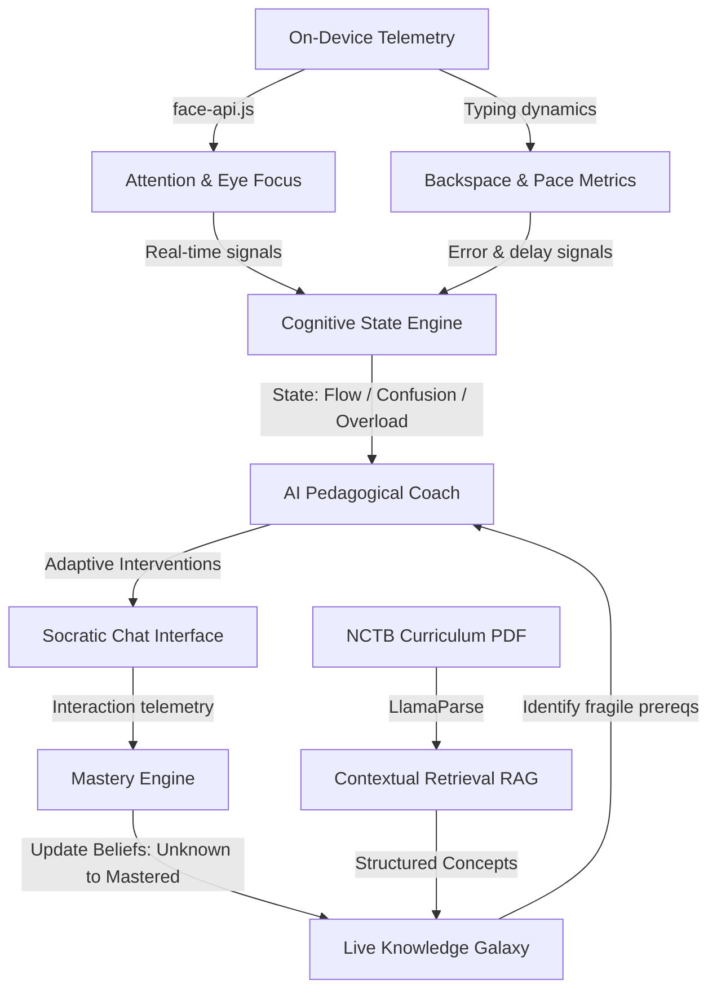

# 🧠 অনুধাবন AI (Anudhabon AI)
## *Where Education Stops Memorizing — And Starts Understanding*

<p align="center">
  
</p>

<p align="center">
  <b>Bangladesh's first AI-native, adaptive remedial learning infrastructure.</b><br>
  Continuously modeling student understanding, detecting conceptual gaps in real time, and dynamically personalizing remediation before students silently fall behind.
</p>

<p align="center">
  <a href="#-core-intelligence-architecture"></a>
  <a href="#-cognitive-learning-state-engine"></a>
  <a href="#-technical-infrastructure"></a>
</p>

---

## ⚡ The Invisible Learning Crisis

Across millions of classrooms, students memorize chapters, pass examinations, and still fail to **truly understand** what they learn. The crisis is invisible. Teachers inside overcrowded classrooms cannot continuously identify:
* 🔍 Who **genuinely understands** vs. who has memorized,
* 😟 Who is **silently struggling** behind a screen,
* 🧱 Which prerequisite concepts are **fragile**,
* ⏳ When **retention is collapsing**,
* 🚨 Or **where intervention is urgently needed**.

As misconceptions compound silently over time, education becomes performance-driven instead of understanding-driven. **Anudhabon AI** was built to solve this.

---

## 🗺️ System Concept Map



---

# 🚀 Core Intelligence Architecture

### 1. Socratic Teach-Back Engine
Instead of passively reading slides or answering multiple-choice questions, students must **explain concepts back to the AI in their own words**. The system continuously evaluates:
*   Conceptual clarity & reasoning depth,
*   Misconception patterns & fragile prerequisite knowledge,
*   Explanation quality & hint dependency.

> **Pedagogical Shift:** Transforming students from passive consumers into active thinkers. Every explanation changes the next question; every misconception triggers a custom remedial action.

---

### 2. Adaptive Mastery Engine
Anudhabon AI maps the student's mind as a continuously evolving intelligence graph. Concept mastery is modeled dynamically using multi-dimensional parameters (explanation quality, quiz accuracy, retention decay, application depth) through five progressive states:

$$\text{Unknown} \longrightarrow \text{Exposed} \longrightarrow \text{Developing} \longrightarrow \text{Practiced} \longrightarrow \text{Mastered}$$

---

### 3. Cognitive Learning State Engine
By analyzing real-time engagement signals, the platform understands *how* students are feeling.
*   **States Modeled:**
    *   `flow` (ফ্লো স্টেট): Deep focus, steady pace, high-quality detailed explanations.
    *   `confused` (বিভ্রান্ত): High backspace ratio, repetitive queries, response latency.
    *   `overloaded` (অতিরিক্ত চাপ): Fatigue indicator; short sentences, frequent eye-wandering.
    *   `disengaged` (অমনোযোগী): Webcam detects student looking away or absence.
*   **Adaptive Response:** If confusion peaks, explanations simplify. If attention wanders, the AI triggers brief eye-rest timers. If flow is detected, it pushes the student with challenging Socratic queries.

---

### 4. Live Knowledge Galaxy & Concept Intelligence System
Every concept is a live node in an interactive, force-directed mind map (built using `React Flow`).
*   **Concept Galaxies:** Visual representation of knowledge links.
*   **Color-Coded Mastery:** Strong concepts stabilize in gold/teal, while fragile nodes show up as warm warning indicators.
*   **Dependency Propagation:** Mastery in parent concepts propagates belief updates to child concepts automatically.

---

### 5. Personalized Remediation & Resource Engine
The platform dynamically generates tailored study materials on the fly:
*   **Adaptive Quizzes:** Questions target historical misconceptions and retention decay.
*   **Prerequisite Topic Recovery:** Automatically pulls up revision notes for basic concepts if the student struggles with advanced topics.
*   **Offline-Ready:** Syncs study notes and session histories to **IndexedDB**, enabling uninterrupted learning even in low-connectivity areas.

---

### 6. AI Classroom & Teacher Intelligence Dashboard
Overcrowded classrooms can scale personalized attention. The Teacher Intelligence Dashboard offers a **3-Way Pivot Switch** (`শিক্ষার্থী | বিষয় | টপিক`):
*   **Student Pivot:** Live engagement timelines, weekly activity reports, and mental state distributions.
*   **Subject Pivot:** Class-wide analytics for Physics, Chemistry, Biology, and Math, tracking average mastery and weak concepts.
*   **Topic Pivot:** Grid analysis of NCTB concepts showing precisely which topics are creating bottlenecks for the entire class.

---

### 7. Parent-Teacher-Student Intelligence Ecosystem
A unified portal where parents receive real-time updates:
*   **Parent Alerts:** Triggers notifications when a student completes a difficult milestone or enters a high-focus flow state.
*   **Struggle Diagnostics:** Highlights exactly which chapters need offline review, ending dark-box learning progress bars.

---

# 🛠️ Technical Infrastructure

Anudhabon AI is built on a modern, robust, and highly optimized stack designed for local execution speed, offline-first reliability, and cognitive modeling.

### 🎨 Frontend & Telemetry
```
├── React 19 & TypeScript  =======> Modern, type-safe interactive components
├── TanStack Start         =======> Full-stack framework (Router, Query, SSR-first)
├── Tailwind CSS v4        =======> Highly customized fluid UI tokens and styles
├── Framer Motion & Three.js ====> Smooth interactive 3D simulations & UI transitions
├── ReactFlow & D3.js      =======> Node mapping for Concept Galaxies
└── face-api.js            =======> On-device, privacy-preserving face & eye telemetry
```

### 🗄️ Backend & Infrastructure
*   **Supabase:** Secure authentication, real-time database channels, and storage buckets.
*   **PostgreSQL:** Relational integrity with custom triggers for real-time parent notifications.
*   **IndexedDB Sync Layer:** Local browser DB caching all session telemetry for offline access.

### 🤖 AI & RAG Pipeline
*   **LLM Architectures:** Orchestrated via `Gemini`, `Groq`, `OpenRouter`, `LLaMA`, and `HuggingFace`.
*   **Contextual RAG Retrieval:**
    *   **LlamaParse:** Extracts structures from raw National Curriculum and Textbook Board (NCTB) PDF curriculum.
    *   **Keyword Scoring & Chunk Injection:** Injects contextually relevant chunks into prompt templates to ensure the AI's math and science explanations strictly align with NCTB standards.

---

## 🚀 Installation & Local Developer Setup

Follow these steps to spin up the local development environment.

### 1. Clone the Repository
```bash
git clone https://github.com/Tony1254-CS/Onudhabon-.git
cd Onudhabon-
```

### 2. Install Dependencies
```bash
npm install
# Or if you use bun
bun install
```

### 3. Setup Environment Files
Create a `.env` file in the root directory:
```env
VITE_SUPABASE_URL=https://your-project-id.supabase.co
VITE_SUPABASE_PUBLISHABLE_KEY=your-anonymous-key
```

### 4. Run Development Server
```bash
npm run dev
```
Open **[http://localhost:8080](http://localhost:8080)** to launch the platform locally.

---

## 🌟 Our Philosophy
Most AI learning platforms generate content. **Anudhabon AI continuously models understanding.** 

We believe the future of education belongs to systems that can:
1.  Detect when a student is struggling *before* they fail a test.
2.  Engage in active dialogue instead of presenting passive static screens.
3.  Visualize the human mind's mastery as a living, breathing ecosystem.

---

*অনুধাবন AI — শিক্ষার গভীরতম উপলব্ধিতে আমাদের যাত্রা।*
