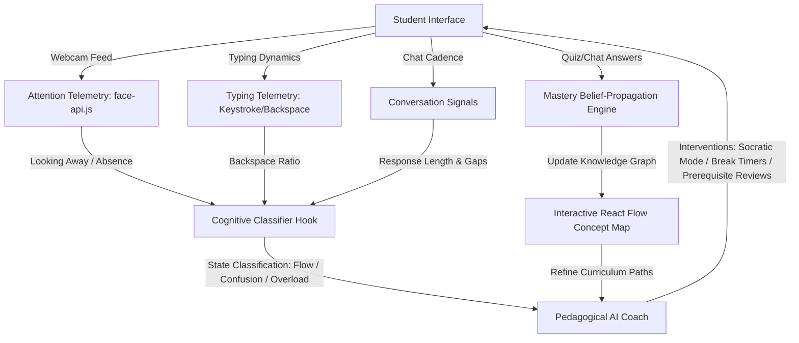

# 🧠 অনুধাবন AI (Onudhabon AI)
### *Next-Generation Cognitive-First AI Learning & Attention Telemetry Platform*

[](#-technology-stack)
[](#-technology-stack)
[](#-cognitive--attention-telemetry)
[](#-offline-first-resilience)

**অনুধাবন (Onudhabon)** is a state-of-the-art, cognitive-first AI tutoring and classroom analytics platform. Unlike traditional learning management systems that only track scores, **Onudhabon** models the learner's mind. By fusing real-time **attention telemetry** (face tracking, eye-wander metrics) with **behavioral metrics** (keystroke dynamics, backspace ratios, conversation cadence), the platform classifies the student's cognitive state into states like *Flow, Confusion, Overload, or Disengagement*, adapting the pedagogical strategy in real-time.

---

## 🗺️ Architectural Vision & Telemetry Loop

The core architecture runs on a continuous feedback loop between the student's telemetry, the local cognitive classifier, the knowledge graph mastery engine, and the AI coach.



---

## 🌟 Key Features

### 🎯 Cognitive & Attention Telemetry
*   **Real-time Attention Telemetry (via `face-api.js`):** Tracks eye focus, head pose, and presence. Detects looking away, absence, or micro-distractions.
*   **Typing Pattern Analysis:** Monitors keystroke dynamics. A high backspace-to-character ratio triggers a "confused" state indicator, warning the tutor that the student is struggling to articulate their thoughts.
*   **Interaction Cadence Tracking:** Analyzes response time and length. Detects cognitive overload when replies shrink or response intervals stretch.
*   **Cognitive States Modeled:**
    *   `flow` (ফ্লো স্টেট): Deep immersion, steady focus, high-quality responses.
    *   `focused` (মনোযোগী): Consistent progress.
    *   `mastery-ready` (আয়ত্তের কাছাকাছি): High accuracy, candidate for advanced Socratic dialogue.
    *   `exploring` (অনুসন্ধানী): Scanning introductory concepts.
    *   `confused` (বিভ্রান্ত): High backspaces or long intervals.
    *   `overloaded` (অতিরিক্ত চাপ): Fatigue indicator; consecutive short replies or eye wandering.
    *   `disengaged` (অমনোযোগী): Student has left the screen or is looking away.

### 🤖 Pedagogical AI Coach & Socratic Dialogue
*   **Real-Time Pedagogy Adjustments:** The AI tutor alters its tone and method according to the cognitive state.
*   **Socratic Mode:** When mastery is near, the AI transitions from explaining to questioning, asking the student to "explain like I am 5" to test deep structural understanding.
*   **Adaptive Interventions:**
    *   *5-Minute Eye-Rest Timers* during cognitive overload.
    *   *Prerequisite Review Popups* when foundational gaps are detected.
    *   *Socratic challenges & Stretch Goals* during flow states.
*   **Native Bengali Text-to-Speech (TTS):** Integrated audio synthesizers read out the tutor's explanations with native Bengali dialect support.

### 🗺️ Dynamic Knowledge Graph & Mastery Propagation
*   **LLM RAG Concept Extraction:** Instantly parses user-provided topics into atomic concepts.
*   **Interactive Mind Maps:** Interactive 2D knowledge graphs constructed with `React Flow`, visually marking strong concepts, weak concepts, and prerequisites.
*   **Mastery Engine:** Updates concepts using a belief-propagation algorithm. When a student masters a concept, confidence scores propagate to related node dependencies.

### 📊 3-Way Pivot Teacher Dashboard
Teachers can pivot their class statistics three ways:
1.  **Student Pivot (শিক্ষার্থী):** Full list of students, active focus timelines, individual skill distribution, and weekly activity reports.
2.  **Subject Pivot (বিষয়):** Comprehensive cards for *Physics, Chemistry, Biology, Mathematics*, showing average mastery, active student count, weak concept alerts, and a classroom-wide concept heatmap.
3.  **Topic Pivot (টপিক):** A sortable tabular grid sorting concepts by mastery level, students struggling, and prerequisite status, making class bottlenecks visible.

### 🛡️ Parent / Observer Portal & Alerts
*   **Real-time Notifications:** Triggers instant WebSocket/real-time database notifications to parents when students hit a "flow state" milestones or show signs of persistent struggle.
*   **Progress Hub:** Displays beautiful donut charts, performance sparklines, and clear summaries of their child's strengths and weaknesses.

### 📶 Offline-First Resilience
*   **Local Storage Sync (IndexedDB):** All session logs, chat histories, and mastery states are cached locally. Learning continues uninterrupted even during internet drops, and auto-syncs to Supabase on reconnection.

---

## 🛠️ Technology Stack

| Layer | Technology |
|---|---|
| **Core Framework** | React 19, TypeScript, **TanStack Start** (Full-stack SSR React Router + Query) |
| **Styling** | **Tailwind CSS v4** (next-gen utility engine), Radix UI (accessible primitives) |
| **Real-time Database & Auth** | **Supabase** (Postgres, Real-time WebSockets, Edge Functions) |
| **Telemetry Engines** | `face-api.js` (Webcam Face/Pose analysis), Custom Keystroke Telemetry |
| **Visualizations** | `React Flow` (Concept maps), `Recharts` (Telemetry analytics & charts) |
| **Animations** | `Framer Motion` (fluid transitions & modal physics), `Lucide React` (icons) |
| **Offline Cache** | IndexedDB, Custom local sync service |

---

## 📂 Repository Structure

```
├── .lovable/                 # Workspace metadata
├── supabase/
│   ├── functions/            # Supabase Edge Functions (RAG Concept extraction & Socratic evaluation)
│   └── migrations/           # Database migration files (Schemas, Real-time triggers, Parent alerts)
├── src/
│   ├── components/
│   │   ├── dashboard/        # Subject view, Topic view, Topic drawer components
│   │   ├── track/            # Parent metrics, Student details, Observer alerts
│   │   ├── learn/            # Cognitive panels, Chat input, Mindmaps, Face telemetry widgets
│   │   └── landing/          # Shared components & Navbars
│   ├── hooks/
│   │   ├── useCognitiveState # Core Rule Engine & state classifier
│   │   ├── useTypingMetrics  # Typing pattern telemetry (backspaces, pace)
│   │   ├── useChatStream     # AI streaming chat integration
│   │   └── useSpeech         # Text-to-Speech synthesis (Bangla voice support)
│   ├── lib/
│   │   ├── idb               # Local IndexedDB persistence layer
│   │   └── masteryEngine     # Concept Graph belief propagation logic
│   └── routes/               # TanStack Router page routing (dashboard, learn, track, etc.)
├── package.json
└── vite.config.ts            # Vite bundler configuration
```

---

## 🚀 Installation & Local Setup

### Prerequisites
*   [Node.js](https://nodejs.org/) (v18+ recommended)
*   [Bun](https://bun.sh/) (or `npm`)
*   A [Supabase](https://supabase.com) Project

### Step 1: Clone and Install
```bash
git clone https://github.com/Tony1254-CS/Onudhabon-.git
cd Onudhabon-
npm install
```

### Step 2: Configure Environment Variables
Create a `.env` file in the root directory:
```env
VITE_SUPABASE_URL=your_supabase_project_url
VITE_SUPABASE_PUBLISHABLE_KEY=your_supabase_anon_key
```

### Step 3: Run the Development Server
```bash
npm run dev
```
Open **[http://localhost:8080](http://localhost:8080)** in your browser to experience the cognitive classroom.

### Step 4: Database Migrations (Optional)
If setting up a new database instance, run the migrations inside the `supabase/migrations/` directory against your database.

---

## 🎯 Future Roadmap
*   **Multi-Modal Emotion Telemetry:** Combining webcam facial expressions with audio tone analysis for advanced frustration detection.
*   **Classroom Groupings:** Automatic AI grouping of students with complementary weak concepts for collaborative study.
*   **Predictive Diagnostics:** Predicting upcoming student dropouts or exam failures based on 30-day cognitive trends.

---

*অনুধাবন AI — শিক্ষার গভীরতম উপলব্ধিতে আমাদের যাত্রা।*
